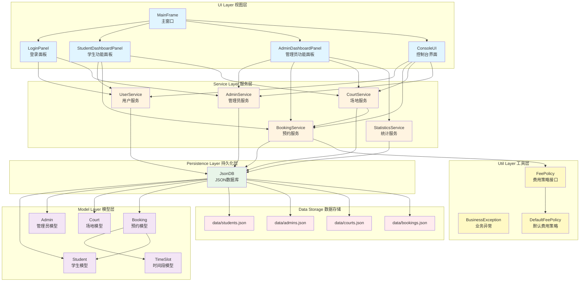

# 系统架构图

```mermaid
graph TB
    subgraph "UI Layer 视图层"
        A[MainFrame<br/>主窗口]
        B[LoginPanel<br/>登录面板]
        C[StudentDashboardPanel<br/>学生功能面板]
        D[AdminDashboardPanel<br/>管理员功能面板]
        E[ConsoleUI<br/>控制台界面]
    end
    
    subgraph "Service Layer 服务层"
        F[UserService<br/>用户服务]
        G[BookingService<br/>预约服务]
        H[CourtService<br/>场地服务]
        I[AdminService<br/>管理员服务]
        J[StatisticsService<br/>统计服务]
    end
    
    subgraph "Persistence Layer 持久化层"
        K[JsonDB<br/>JSON数据库]
    end
    
    subgraph "Model Layer 模型层"
        L[Student<br/>学生模型]
        M[Admin<br/>管理员模型]
        N[Court<br/>场地模型]
        O[Booking<br/>预约模型]
        P[TimeSlot<br/>时间段模型]
    end
    
    subgraph "Util Layer 工具层"
        Q[BusinessException<br/>业务异常]
        R[FeePolicy<br/>费用策略接口]
        S[DefaultFeePolicy<br/>默认费用策略]
    end
    
    subgraph "Data Storage 数据存储"
        T[data/students.json]
        U[data/admins.json]
        V[data/courts.json]
        W[data/bookings.json]
    end
    
    A --> B
    A --> C
    A --> D
    A --> E
    
    B --> F
    B --> I
    C --> F
    C --> G
    C --> H
    D --> I
    D --> G
    D --> H
    D --> J
    E --> F
    E --> G
    E --> H
    E --> I
    
    F --> K
    G --> K
    G --> R
    H --> K
    H --> G
    I --> K
    J --> K
    
    R --> S
    
    K --> L
    K --> M
    K --> N
    K --> O
    O --> P
    O --> L
    
    K --> T
    K --> U
    K --> V
    K --> W
    
    style A fill:#e1f5ff
    style B fill:#e1f5ff
    style C fill:#e1f5ff
    style D fill:#e1f5ff
    style E fill:#e1f5ff
    style F fill:#fff4e1
    style G fill:#fff4e1
    style H fill:#fff4e1
    style I fill:#fff4e1
    style J fill:#fff4e1
    style K fill:#e8f5e9
    style L fill:#f3e5f5
    style M fill:#f3e5f5
    style N fill:#f3e5f5
    style O fill:#f3e5f5
    style P fill:#f3e5f5
    style Q fill:#fff9c4
    style R fill:#fff9c4
    style S fill:#fff9c4
    style T fill:#ffebee
    style U fill:#ffebee
    style V fill:#ffebee
    style W fill:#ffebee
```

