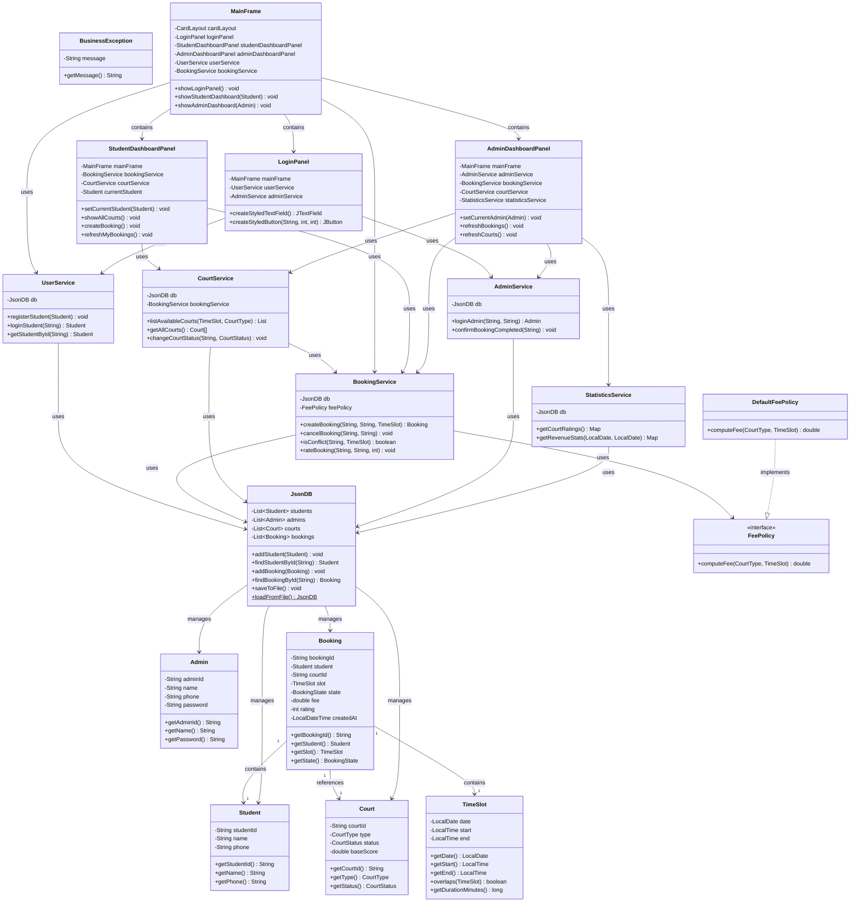

# 类图 (UML Class Diagram)

```mermaid
classDiagram
    class Student {
        -String studentId
        -String name
        -String phone
        +getStudentId() String
        +getName() String
        +getPhone() String
    }
    
    class Admin {
        -String adminId
        -String name
        -String phone
        -String password
        +getAdminId() String
        +getName() String
        +getPassword() String
    }
    
    class Court {
        -String courtId
        -CourtType type
        -CourtStatus status
        -double baseScore
        +getCourtId() String
        +getType() CourtType
        +getStatus() CourtStatus
    }
    
    class Booking {
        -String bookingId
        -Student student
        -String courtId
        -TimeSlot slot
        -BookingState state
        -double fee
        -int rating
        -LocalDateTime createdAt
        +getBookingId() String
        +getStudent() Student
        +getSlot() TimeSlot
        +getState() BookingState
    }
    
    class TimeSlot {
        -LocalDate date
        -LocalTime start
        -LocalTime end
        +getDate() LocalDate
        +getStart() LocalTime
        +getEnd() LocalTime
        +overlaps(TimeSlot) boolean
        +getDurationMinutes() long
    }
    
    class JsonDB {
        -List~Student~ students
        -List~Admin~ admins
        -List~Court~ courts
        -List~Booking~ bookings
        +addStudent(Student) void
        +findStudentById(String) Student
        +addBooking(Booking) void
        +findBookingById(String) Booking
        +saveToFile() void
        +loadFromFile() JsonDB$
    }
    
    class UserService {
        -JsonDB db
        +registerStudent(Student) void
        +loginStudent(String) Student
        +getStudentById(String) Student
    }
    
    class BookingService {
        -JsonDB db
        -FeePolicy feePolicy
        +createBooking(String, String, TimeSlot) Booking
        +cancelBooking(String, String) void
        +isConflict(String, TimeSlot) boolean
        +rateBooking(String, String, int) void
    }
    
    class CourtService {
        -JsonDB db
        -BookingService bookingService
        +listAvailableCourts(TimeSlot, CourtType) List
        +getAllCourts() Court[]
        +changeCourtStatus(String, CourtStatus) void
    }
    
    class AdminService {
        -JsonDB db
        +loginAdmin(String, String) Admin
        +confirmBookingCompleted(String) void
    }
    
    class StatisticsService {
        -JsonDB db
        +getCourtRatings() Map
        +getRevenueStats(LocalDate, LocalDate) Map
    }
    
    class FeePolicy {
        <<interface>>
        +computeFee(CourtType, TimeSlot) double
    }
    
    class DefaultFeePolicy {
        +computeFee(CourtType, TimeSlot) double
    }
    
    class BusinessException {
        -String message
        +getMessage() String
    }
    
    class MainFrame {
        -CardLayout cardLayout
        -LoginPanel loginPanel
        -StudentDashboardPanel studentDashboardPanel
        -AdminDashboardPanel adminDashboardPanel
        -UserService userService
        -BookingService bookingService
        +showLoginPanel() void
        +showStudentDashboard(Student) void
        +showAdminDashboard(Admin) void
    }
    
    class LoginPanel {
        -MainFrame mainFrame
        -UserService userService
        -AdminService adminService
        +createStyledTextField() JTextField
        +createStyledButton(String, int, int) JButton
    }
    
    class StudentDashboardPanel {
        -MainFrame mainFrame
        -BookingService bookingService
        -CourtService courtService
        -Student currentStudent
        +setCurrentStudent(Student) void
        +showAllCourts() void
        +createBooking() void
        +refreshMyBookings() void
    }
    
    class AdminDashboardPanel {
        -MainFrame mainFrame
        -AdminService adminService
        -BookingService bookingService
        -CourtService courtService
        -StatisticsService statisticsService
        +setCurrentAdmin(Admin) void
        +refreshBookings() void
        +refreshCourts() void
    }
    
    %% 关系定义
    Booking "1" --> "1" Student : contains
    Booking "1" --> "1" TimeSlot : contains
    Booking "1" --> "1" Court : references
    
    UserService --> JsonDB : uses
    BookingService --> JsonDB : uses
    BookingService --> FeePolicy : uses
    CourtService --> JsonDB : uses
    CourtService --> BookingService : uses
    AdminService --> JsonDB : uses
    StatisticsService --> JsonDB : uses
    
    DefaultFeePolicy ..|> FeePolicy : implements
    
    JsonDB --> Student : manages
    JsonDB --> Admin : manages
    JsonDB --> Court : manages
    JsonDB --> Booking : manages
    
    MainFrame --> LoginPanel : contains
    MainFrame --> StudentDashboardPanel : contains
    MainFrame --> AdminDashboardPanel : contains
    MainFrame --> UserService : uses
    MainFrame --> BookingService : uses
    
    LoginPanel --> UserService : uses
    LoginPanel --> AdminService : uses
    
    StudentDashboardPanel --> BookingService : uses
    StudentDashboardPanel --> CourtService : uses
    
    AdminDashboardPanel --> AdminService : uses
    AdminDashboardPanel --> BookingService : uses
    AdminDashboardPanel --> CourtService : uses
    AdminDashboardPanel --> StatisticsService : uses
```

