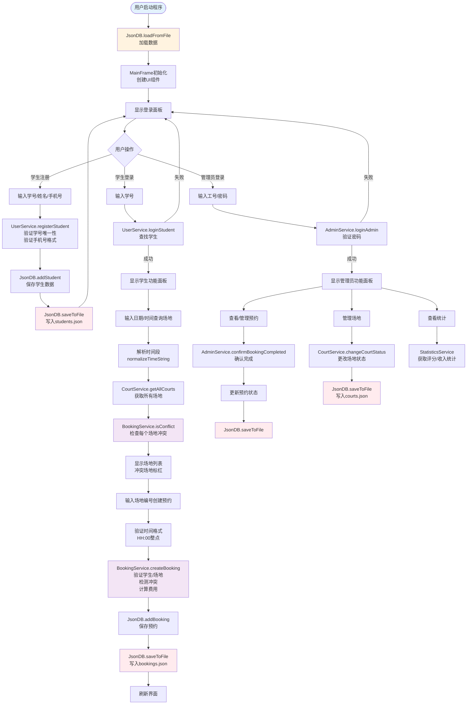

# 数据流图 (Data Flow Diagram)

```mermaid
flowchart TD
    Start([用户启动程序]) --> LoadData[JsonDB.loadFromFile<br/>加载数据]
    LoadData --> InitUI[MainFrame初始化<br/>创建UI组件]
    InitUI --> ShowLogin[显示登录面板]
    
    ShowLogin --> UserAction{用户操作}
    
    UserAction -->|学生注册| RegStudent[输入学号/姓名/手机号]
    RegStudent --> ValidateReg[UserService.registerStudent<br/>验证学号唯一性<br/>验证手机号格式]
    ValidateReg --> SaveStudent[JsonDB.addStudent<br/>保存学生数据]
    SaveStudent --> SaveFile1[JsonDB.saveToFile<br/>写入students.json]
    SaveFile1 --> ShowLogin
    
    UserAction -->|学生登录| LoginStudent[输入学号]
    LoginStudent --> CheckStudent[UserService.loginStudent<br/>查找学生]
    CheckStudent -->|成功| ShowStudentDash[显示学生功能面板]
    CheckStudent -->|失败| ShowLogin
    
    UserAction -->|管理员登录| LoginAdmin[输入工号/密码]
    LoginAdmin --> CheckAdmin[AdminService.loginAdmin<br/>验证密码]
    CheckAdmin -->|成功| ShowAdminDash[显示管理员功能面板]
    CheckAdmin -->|失败| ShowLogin
    
    ShowStudentDash --> QueryCourts[输入日期/时间查询场地]
    QueryCourts --> ParseTime[解析时间段<br/>normalizeTimeString]
    ParseTime --> GetCourts[CourtService.getAllCourts<br/>获取所有场地]
    GetCourts --> CheckConflict[BookingService.isConflict<br/>检查每个场地冲突]
    CheckConflict --> DisplayCourts[显示场地列表<br/>冲突场地标红]
    
    DisplayCourts --> CreateBooking[输入场地编号创建预约]
    CreateBooking --> ValidateTime[验证时间格式<br/>HH:00整点]
    ValidateTime --> ValidateBooking[BookingService.createBooking<br/>验证学生/场地<br/>检测冲突<br/>计算费用]
    ValidateBooking --> SaveBooking[JsonDB.addBooking<br/>保存预约]
    SaveBooking --> SaveFile2[JsonDB.saveToFile<br/>写入bookings.json]
    SaveFile2 --> RefreshUI[刷新界面]
    
    ShowAdminDash --> ManageBookings[查看/管理预约]
    ManageBookings --> ConfirmComplete[AdminService.confirmBookingCompleted<br/>确认完成]
    ConfirmComplete --> UpdateBooking[更新预约状态]
    UpdateBooking --> SaveFile3[JsonDB.saveToFile]
    
    ShowAdminDash --> ManageCourts[管理场地]
    ManageCourts --> ChangeStatus[CourtService.changeCourtStatus<br/>更改场地状态]
    ChangeStatus --> SaveFile4[JsonDB.saveToFile<br/>写入courts.json]
    
    ShowAdminDash --> ViewStats[查看统计]
    ViewStats --> GetStats[StatisticsService<br/>获取评分/收入统计]
    
    style Start fill:#e3f2fd
    style LoadData fill:#fff3e0
    style SaveFile1 fill:#ffebee
    style SaveFile2 fill:#ffebee
    style SaveFile3 fill:#ffebee
    style SaveFile4 fill:#ffebee
    style CheckConflict fill:#f3e5f5
    style ValidateBooking fill:#f3e5f5
```

