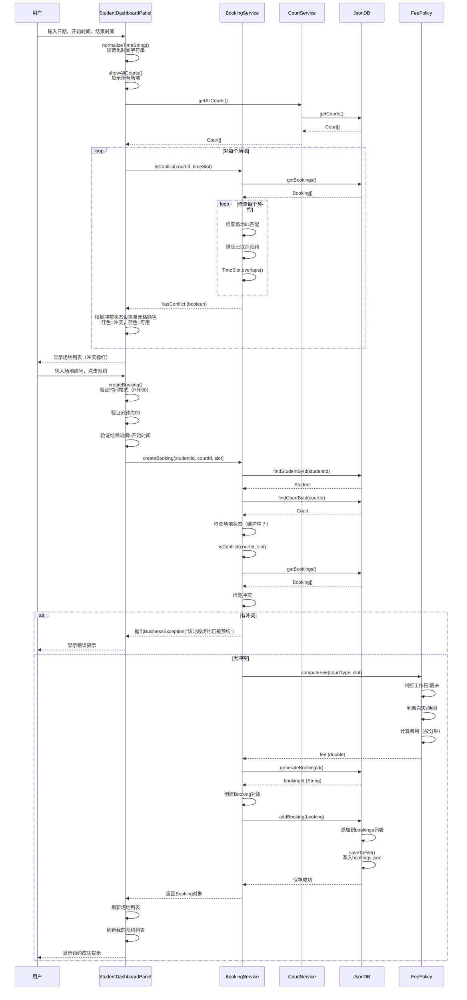

# 预约流程时序图

```mermaid
sequenceDiagram
    participant User as 用户
    participant SDP as StudentDashboardPanel
    participant BS as BookingService
    participant CS as CourtService
    participant DB as JsonDB
    participant FP as FeePolicy
    
    User->>SDP: 输入日期、开始时间、结束时间
    SDP->>SDP: normalizeTimeString()<br/>规范化时间字符串
    SDP->>SDP: showAllCourts()<br/>显示所有场地
    SDP->>CS: getAllCourts()
    CS->>DB: getCourts()
    DB-->>CS: Court[]
    CS-->>SDP: Court[]
    
    loop 对每个场地
        SDP->>BS: isConflict(courtId, timeSlot)
        BS->>DB: getBookings()
        DB-->>BS: Booking[]
        loop 检查每个预约
            BS->>BS: 检查场地ID匹配
            BS->>BS: 排除已取消预约
            BS->>BS: TimeSlot.overlaps()
        end
        BS-->>SDP: hasConflict (boolean)
        SDP->>SDP: 根据冲突状态设置单元格颜色<br/>红色=冲突，蓝色=可用
    end
    
    SDP-->>User: 显示场地列表（冲突标红）
    
    User->>SDP: 输入场地编号，点击预约
    SDP->>SDP: createBooking()<br/>验证时间格式（HH:00）
    SDP->>SDP: 验证分钟为00
    SDP->>SDP: 验证结束时间>开始时间
    
    SDP->>BS: createBooking(studentId, courtId, slot)
    BS->>DB: findStudentById(studentId)
    DB-->>BS: Student
    
    BS->>DB: findCourtById(courtId)
    DB-->>BS: Court
    
    BS->>BS: 检查场地状态（维护中？）
    BS->>BS: isConflict(courtId, slot)
    BS->>DB: getBookings()
    DB-->>BS: Booking[]
    BS->>BS: 检测冲突
    
    alt 有冲突
        BS-->>SDP: 抛出BusinessException("该时段场地已被预约")
        SDP-->>User: 显示错误提示
    else 无冲突
        BS->>FP: computeFee(courtType, slot)
        FP->>FP: 判断工作日/周末
        FP->>FP: 判断白天/晚间
        FP->>FP: 计算费用（按分钟）
        FP-->>BS: fee (double)
        
        BS->>DB: generateBookingId()
        DB-->>BS: bookingId (String)
        
        BS->>BS: 创建Booking对象
        BS->>DB: addBooking(booking)
        DB->>DB: 添加到bookings列表
        DB->>DB: saveToFile()<br/>写入bookings.json
        DB-->>BS: 保存成功
        
        BS-->>SDP: 返回Booking对象
        SDP->>SDP: 刷新场地列表
        SDP->>SDP: 刷新我的预约列表
        SDP-->>User: 显示预约成功提示
    end
```

