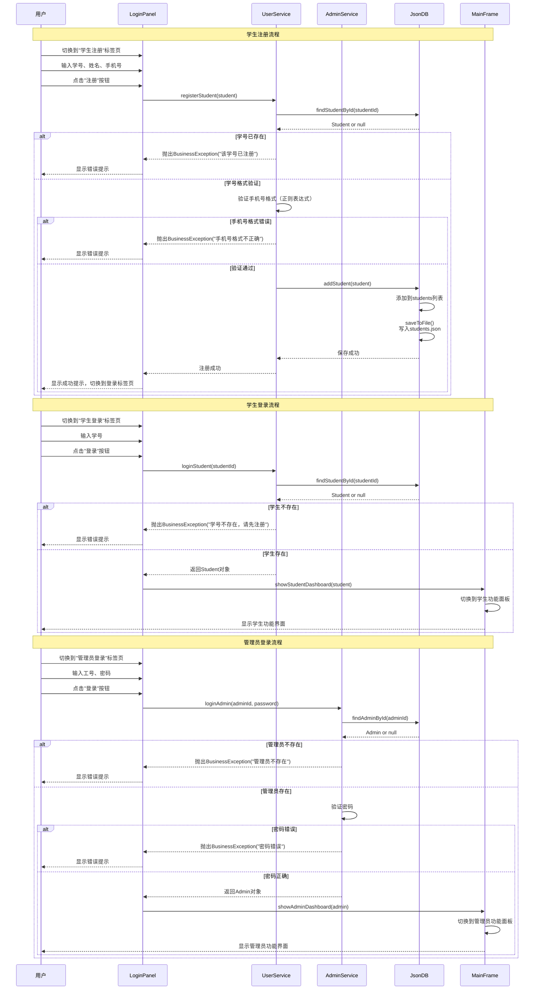

# 登录流程时序图

```mermaid
sequenceDiagram
    participant User as 用户
    participant LP as LoginPanel
    participant US as UserService
    participant AS as AdminService
    participant DB as JsonDB
    participant MF as MainFrame
    
    Note over User,MF: 学生注册流程
    User->>LP: 切换到"学生注册"标签页
    User->>LP: 输入学号、姓名、手机号
    User->>LP: 点击"注册"按钮
    
    LP->>US: registerStudent(student)
    US->>DB: findStudentById(studentId)
    DB-->>US: Student or null
    
    alt 学号已存在
        US-->>LP: 抛出BusinessException("该学号已注册")
        LP-->>User: 显示错误提示
    else 学号格式验证
        US->>US: 验证手机号格式（正则表达式）
        alt 手机号格式错误
            US-->>LP: 抛出BusinessException("手机号格式不正确")
            LP-->>User: 显示错误提示
        else 验证通过
            US->>DB: addStudent(student)
            DB->>DB: 添加到students列表
            DB->>DB: saveToFile()<br/>写入students.json
            DB-->>US: 保存成功
            US-->>LP: 注册成功
            LP-->>User: 显示成功提示，切换到登录标签页
        end
    end
    
    Note over User,MF: 学生登录流程
    User->>LP: 切换到"学生登录"标签页
    User->>LP: 输入学号
    User->>LP: 点击"登录"按钮
    
    LP->>US: loginStudent(studentId)
    US->>DB: findStudentById(studentId)
    DB-->>US: Student or null
    
    alt 学生不存在
        US-->>LP: 抛出BusinessException("学号不存在，请先注册")
        LP-->>User: 显示错误提示
    else 学生存在
        US-->>LP: 返回Student对象
        LP->>MF: showStudentDashboard(student)
        MF->>MF: 切换到学生功能面板
        MF-->>User: 显示学生功能界面
    end
    
    Note over User,MF: 管理员登录流程
    User->>LP: 切换到"管理员登录"标签页
    User->>LP: 输入工号、密码
    User->>LP: 点击"登录"按钮
    
    LP->>AS: loginAdmin(adminId, password)
    AS->>DB: findAdminById(adminId)
    DB-->>AS: Admin or null
    
    alt 管理员不存在
        AS-->>LP: 抛出BusinessException("管理员不存在")
        LP-->>User: 显示错误提示
    else 管理员存在
        AS->>AS: 验证密码
        alt 密码错误
            AS-->>LP: 抛出BusinessException("密码错误")
            LP-->>User: 显示错误提示
        else 密码正确
            AS-->>LP: 返回Admin对象
            LP->>MF: showAdminDashboard(admin)
            MF->>MF: 切换到管理员功能面板
            MF-->>User: 显示管理员功能界面
        end
    end
```

