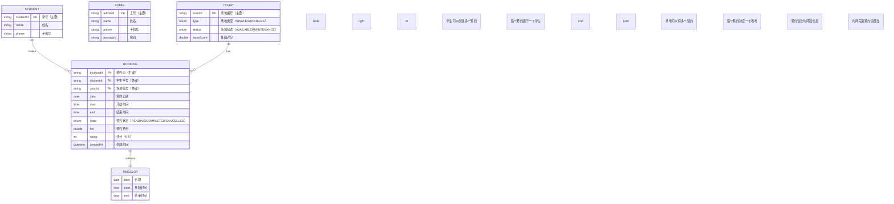

# 数据模型关系图 (ER Diagram)

```mermaid
erDiagram
    STUDENT {
        string studentId PK "学号（主键）"
        string name "姓名"
        string phone "手机号"
    }
    
    ADMIN {
        string adminId PK "工号（主键）"
        string name "姓名"
        string phone "手机号"
        string password "密码"
    }
    
    COURT {
        string courtId PK "场地编号（主键）"
        enum type "场地类型（SINGLES/DOUBLES）"
        enum status "场地状态（AVAILABLE/MAINTENANCE）"
        double baseScore "基础评分"
    }
    
    BOOKING {
        string bookingId PK "预约ID（主键）"
        string studentId FK "学生学号（外键）"
        string courtId FK "场地编号（外键）"
        date date "预约日期"
        time start "开始时间"
        time end "结束时间"
        enum state "预约状态（PENDING/COMPLETED/CANCELLED）"
        double fee "预约费用"
        int rating "评分（0-5）"
        datetime createdAt "创建时间"
    }
    
    TIMESLOT {
        date date "日期"
        time start "开始时间"
        time end "结束时间"
    }
    
    STUDENT ||--o{ BOOKING : "makes"
    COURT ||--o{ BOOKING : "has"
    BOOKING ||--|| TIMESLOT : "contains"
    
    Note right of STUDENT
        学生可以创建多个预约
        每个预约属于一个学生
    end note
    
    Note right of COURT
        场地可以有多个预约
        每个预约对应一个场地
    end note
    
    Note right of BOOKING
        预约包含时间段信息
        时间段是预约的属性
    end note
```

