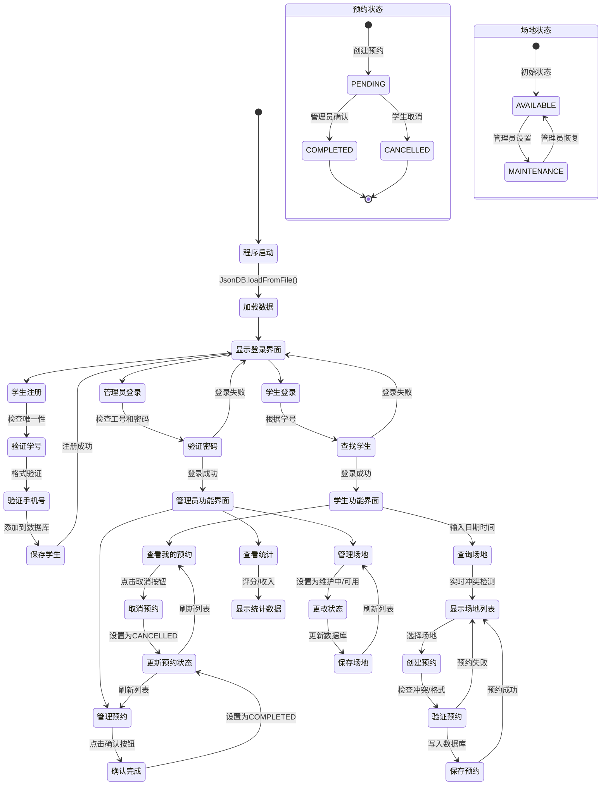

# 状态转换图

```mermaid
stateDiagram-v2
    [*] --> 程序启动
    程序启动 --> 加载数据: JsonDB.loadFromFile()
    加载数据 --> 显示登录界面
    
    显示登录界面 --> 学生注册
    显示登录界面 --> 学生登录
    显示登录界面 --> 管理员登录
    
    学生注册 --> 验证学号: 检查唯一性
    验证学号 --> 验证手机号: 格式验证
    验证手机号 --> 保存学生: 添加到数据库
    保存学生 --> 显示登录界面: 注册成功
    
    学生登录 --> 查找学生: 根据学号
    查找学生 --> 学生功能界面: 登录成功
    查找学生 --> 显示登录界面: 登录失败
    
    管理员登录 --> 验证密码: 检查工号和密码
    验证密码 --> 管理员功能界面: 登录成功
    验证密码 --> 显示登录界面: 登录失败
    
    学生功能界面 --> 查询场地: 输入日期时间
    查询场地 --> 显示场地列表: 实时冲突检测
    显示场地列表 --> 创建预约: 选择场地
    创建预约 --> 验证预约: 检查冲突/格式
    验证预约 --> 保存预约: 写入数据库
    保存预约 --> 显示场地列表: 预约成功
    验证预约 --> 显示场地列表: 预约失败
    
    学生功能界面 --> 查看我的预约
    查看我的预约 --> 取消预约: 点击取消按钮
    取消预约 --> 更新预约状态: 设置为CANCELLED
    更新预约状态 --> 查看我的预约: 刷新列表
    
    管理员功能界面 --> 管理预约
    管理预约 --> 确认完成: 点击确认按钮
    确认完成 --> 更新预约状态: 设置为COMPLETED
    更新预约状态 --> 管理预约: 刷新列表
    
    管理员功能界面 --> 管理场地
    管理场地 --> 更改状态: 设置为维护中/可用
    更改状态 --> 保存场地: 更新数据库
    保存场地 --> 管理场地: 刷新列表
    
    管理员功能界面 --> 查看统计
    查看统计 --> 显示统计数据: 评分/收入
    
    state 预约状态 {
        [*] --> PENDING: 创建预约
        PENDING --> COMPLETED: 管理员确认
        PENDING --> CANCELLED: 学生取消
        COMPLETED --> [*]
        CANCELLED --> [*]
    }
    
    state 场地状态 {
        [*] --> AVAILABLE: 初始状态
        AVAILABLE --> MAINTENANCE: 管理员设置
        MAINTENANCE --> AVAILABLE: 管理员恢复
    }
```

