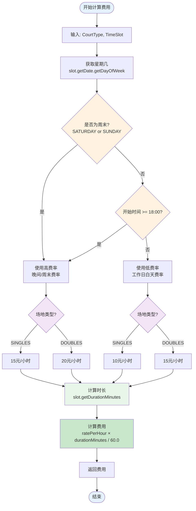

# 费用计算流程图

```mermaid
flowchart TD
    Start([开始计算费用]) --> Input[输入: CourtType, TimeSlot]
    Input --> GetDayOfWeek[获取星期几<br/>slot.getDate.getDayOfWeek]
    GetDayOfWeek --> CheckWeekend{是否为周末?<br/>SATURDAY or SUNDAY}
    
    CheckWeekend -->|是| SetHighRate[使用高费率<br/>晚间/周末费率]
    CheckWeekend -->|否| CheckEvening{开始时间 >= 18:00?}
    
    CheckEvening -->|是| SetHighRate
    CheckEvening -->|否| SetLowRate[使用低费率<br/>工作日白天费率]
    
    SetHighRate --> CheckType1{场地类型?}
    SetLowRate --> CheckType2{场地类型?}
    
    CheckType1 -->|SINGLES| Rate1[15元/小时]
    CheckType1 -->|DOUBLES| Rate2[20元/小时]
    
    CheckType2 -->|SINGLES| Rate3[10元/小时]
    CheckType2 -->|DOUBLES| Rate4[15元/小时]
    
    Rate1 --> CalculateDuration
    Rate2 --> CalculateDuration
    Rate3 --> CalculateDuration
    Rate4 --> CalculateDuration
    
    CalculateDuration[计算时长<br/>slot.getDurationMinutes] --> CalcFee[计算费用<br/>ratePerHour × durationMinutes / 60.0]
    CalcFee --> ReturnFee[返回费用]
    ReturnFee --> End([结束])
    
    style Start fill:#e3f2fd
    style CheckWeekend fill:#fff3e0
    style CheckEvening fill:#fff3e0
    style CheckType1 fill:#f3e5f5
    style CheckType2 fill:#f3e5f5
    style CalculateDuration fill:#e8f5e9
    style CalcFee fill:#c8e6c9
    style End fill:#e3f2fd
```

